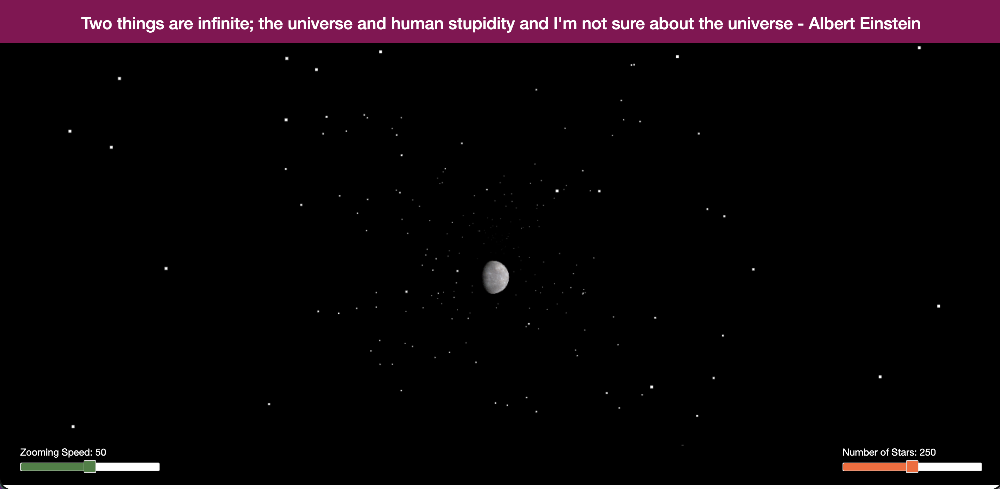

# Welcome to the world of Azure DevOps + Java




Sample web application written in Java and uses AngularJS.

## Run locally (Tomcat)

### 1) Build the WAR

```bash
mvn -DskipTests package
```

This produces `target/DeepSpace.war`.

### 2) Deploy to Tomcat

Use Tomcat 9.x (Tomcat 10+ switched to `jakarta.*` APIs and won’t run this `javax.*` app without migration).

This app expects to run at the root context path (it references assets like `/images/...`), so deploy it as `ROOT`.

```bash
export CATALINA_HOME=/path/to/apache-tomcat-9.x

# stop Tomcat if already running
"$CATALINA_HOME/bin/shutdown.sh" || true

# deploy as ROOT (remove the default ROOT app first if present)
rm -rf "$CATALINA_HOME/webapps/ROOT" "$CATALINA_HOME/webapps/ROOT.war"
cp target/DeepSpace.war "$CATALINA_HOME/webapps/ROOT.war"

# start Tomcat in the foreground (preferred for local dev)
"$CATALINA_HOME/bin/catalina.sh" run
```

Open:
- `http://localhost:8080/`
- API check: `http://localhost:8080/api/images`

Logs:
- `$CATALINA_HOME/logs/catalina.out`

## Quick run (Jetty via Maven)

If you just want to run the app without installing Tomcat:

```bash
mvn jetty:run
```

Then open `http://localhost:3030/`.
