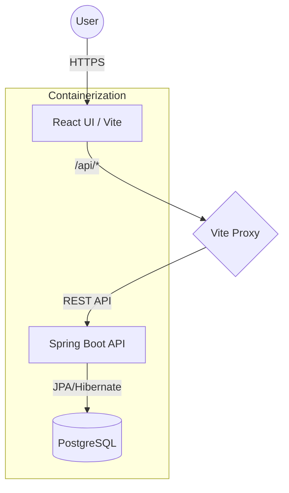

# DeepSpace Observatory Portal

DeepSpace is a high-fidelity, cinematic interstellar observatory portal designed to provide real-time telemetry, planetary data, and cosmic event tracking. It combines high-end visual design with robust backend engineering to offer an immersive experience into our solar system and beyond.

## 🚀 Key Features

*   **Interactive Planetary Registry**: Explore celestial bodies with high-fidelity, rotating 3D planetary models (powered by Three.js).
*   **ISS Live Telemetry**: Real-time tracking of the International Space Station utilizing integrated Map services.
*   **Observatory Dashboard**: Live monitoring of cosmic data including Solar Activity Indices, Orbital Dynamics, and Celestial Calendars.
*   **Cinematic Design**: A premium, minimalist UI/UX featuring neon-cyan accents, glassmorphic interfaces, and immersive cosmic background animations.
*   **Universal Archive**: A dynamic repository of space facts with interactive 3D flip-card experiences.

## 🛠 Tech Stack

### Frontend
- **React** with **Vite**
- **Tailwind CSS v4** for high-performance styling
- **Three.js & React Three Fiber** for 3D planetary rendering
- **Framer Motion** for cinematic UI interactions

### Backend
- **Spring Boot** (Java) REST API
- **PostgreSQL** Database
- **Flyway** for database migration management

## 🏗 Architecture
DeepSpace is built as a modular, containerized application with a clear separation of concerns:

- **Client-Server Architecture**: The frontend communicates with the Spring Boot backend via a RESTful API. To manage development environments, **Vite** is configured as a reverse proxy, mapping `/api` requests to `localhost:8080`.
- **Persistence Layer**: Data modeling is handled via JPA entities mapping to a PostgreSQL instance, with version-controlled migrations via Flyway.
- **Containerized Orchestration**: The application is managed via `docker-compose`, providing an isolated, portable, and production-reproducible environment.
- **Async Data Flow**: Frontend UI components (Observatory, Satellite Tracker, Planets) utilize asynchronous service hooks to maintain responsiveness during data fetching.

### System Diagram

```mermaid
graph TD
    User((User)) -->|HTTPS| UI[React UI / Vite]
    UI -->|/api/*| Proxy{Vite Proxy}
    Proxy -->|REST API| API[Spring Boot API]
    API -->|JPA/Hibernate| DB[(PostgreSQL)]
    
    subgraph Containerization
        UI
        API
        DB
    end
```

## 🚀 Getting Started

### Local Development
1. Clone the repository: `git clone <repo-url>`
2. Start the services using Docker Compose:
   ```bash
   docker-compose up -d
   ```
3. Navigate to `deepspace-ui` and install dependencies:
   ```bash
   cd deepspace-ui
   npm install
   npm run dev
   ```
4. Access the portal at `http://localhost:5173/`

### API Configuration
The backend runs on `localhost:8080`. Ensure PostgreSQL is running on the default port 5432 via Docker.

**API Documentation**: You can access the interactive Swagger UI at [http://localhost:8080/swagger-ui.html](http://localhost:8080/swagger-ui.html).

## 📜 Documentation
- [Project Structure](./deepspace-api/PROJECT_STRUCTURE.md)
- [Quickstart Guide](./deepspace-api/QUICKSTART.md)
- [Refactoring History](./REFACTORING_SUMMARY.md)

---
*DeepSpace Observatory — Navigating the Unknown.*
